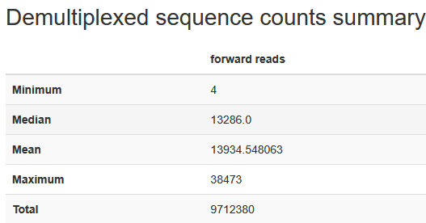
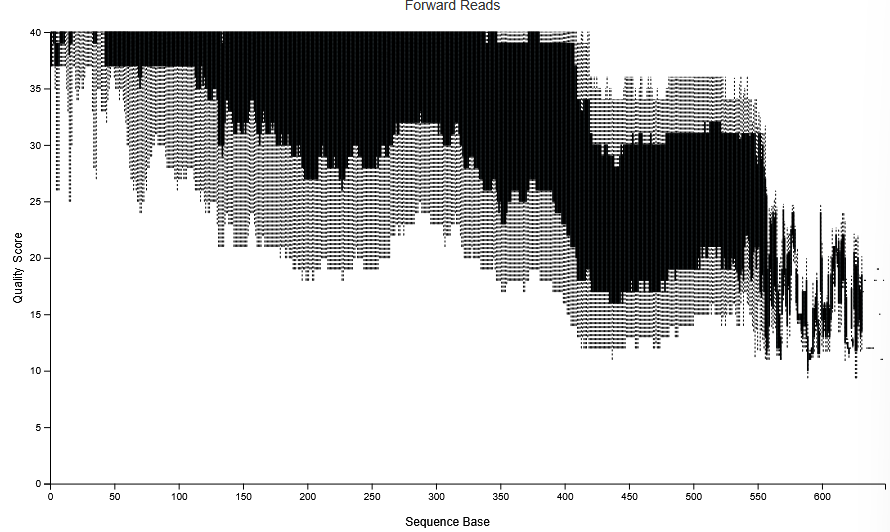
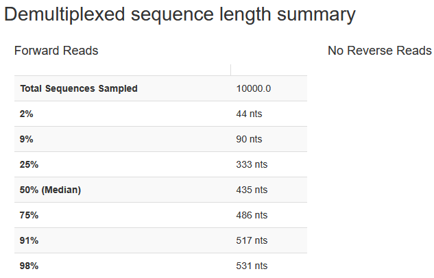

# 1. QIIME2 Data Processing

## Aim:
* Import and demultiplex data from soil dataset
* Denoise data by trimming and removing low quality reads
* Cluster unique reads into amplicon sequence variants (ASVs)
* Filter out mitochondrial and chloroplast DNA

## Code
[QIIME2 Script](../QIIME2/qiime2_script.sh)

## Results

### Post-demultiplexing
[demux.qzv](../QIIME2/output/demux.qzv)

**Demux Sequence Statistics**:

**Quality Score per Base**:

**rep-seqs.qzv**

**Demux Sequence Lengths**:

Decided to trim to 390 bp

### ASVs

### Taxonomy Analysis
* Trained classifier using universal 27F and 519R primers covering V1 to V3
* Performed taxonomic analysis using this classifier

### Mitochondria and chloroplast filtered table
* Lost 1 sample and ~ 7000 ASVs

### Organic layer + no herbicide + BC only filtering

5296 potentially good sampling depth?
Samples retained: 27 (OM1), 25 (OM2), 10 (REF)

### Rarefaction curve

Sequencing depth of ~3000 identified as the minimum

Sampling depth revision to 3310 <br\>

Samples retained: 45 (OM1), 41 (OM2), 15 (REF)

* Confirmed with Bessie, will be used going forward
 
