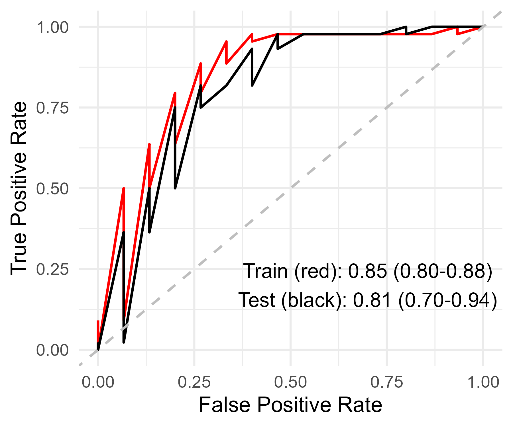
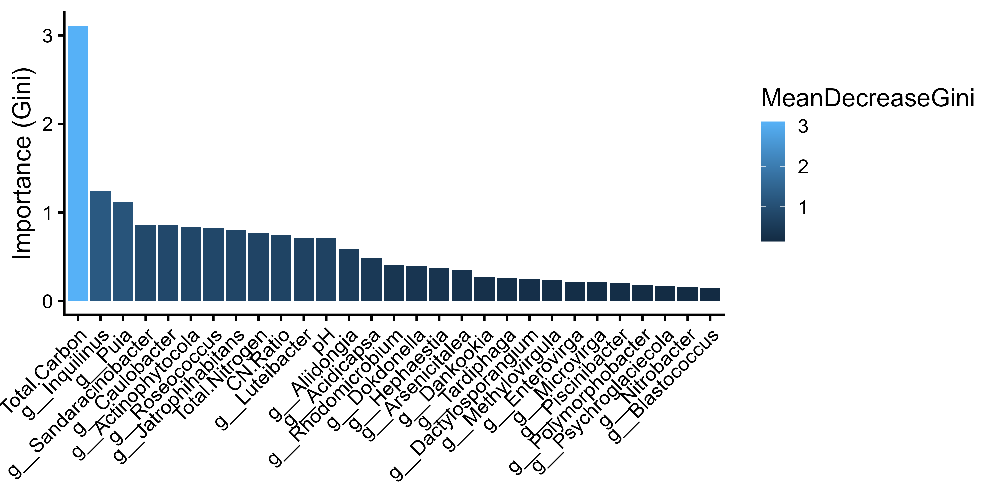
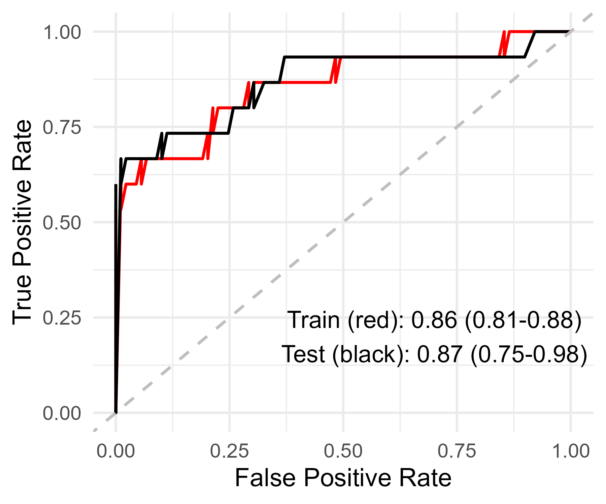
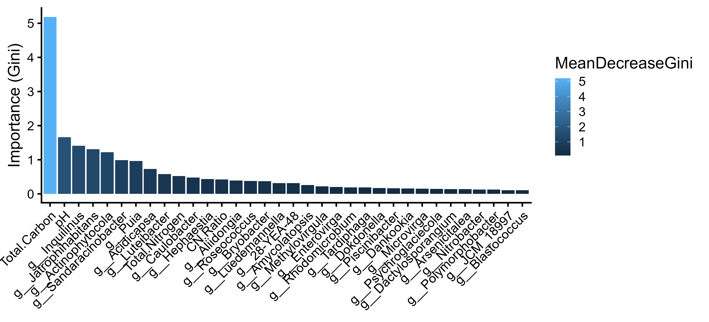

# Aim 3: Random Forest

## Aim
* To develop a random forest model using soil conditions and bacterial populations to predict level of OM Removal (REF/OM1/OM2)

## Code
[OM1 vs REF](../R_scripts/3_RandomForest_OM1_REF.R) \
[OM2 vs REF](../R_scripts/3_RandomForest_OM2_REF.R) \
[OM2 vs OM1](../R_scripts/3_RandomForest_OM1_OM2.R) \
[OM vs REF](../R_scripts/3_RandomForest_OM_REF.R)

## OM1 VS OM2

## OM1 vs REF

## OM2 vs REF

## Combined OM1 + OM2 vs REF

