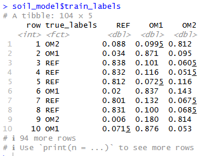

# Aim 3: Random Forest - Multi-Class

## Aim
* To develop a random forest model using soil conditions and bacterial populations to predict level of OM Removal (REF/OM1/OM2)

## Code
[Main Script: Random_Forest.R](https://github.com/tiffanyxie/MICB475_Team3/blob/main/R_scripts/3_RandomForest.R)

[Original Random Forest Functions (not used, just for reference)](https://github.com/tiffanyxie/MICB475_Team3/blob/main/R_scripts/3_randomforest_functions.R)

[Modified Random Forest Functions (used in main script)](https://github.com/tiffanyxie/MICB475_Team3/blob/main/R_scripts/3_randomforest_functions_modified.R)

### Modifications to Random_Forest.R
1) Changed outcomes from a two-level factor to a three level factor y = factor(y, levels = c("REF","OM1","OM2"))

2) Added confusion matrix to results interpretation and no longer generating ROC Curves
    *  confusionMatrix() function takes in factor of predicted results (e.g. OM1, OM2, REF, etc.) and factor of the true results (OM1, OM1, REF)
    * Current model has table with true_labels and columns with probability of REF, OM1, and OM2

        
    * In order to get factor of predicted results -> set prediction as column with highest probability
    * Then run confusionMatrix(result,true) where result is predicted results and true is the actual value for test and training data

3) Changed *source(randomforest_functions.R)* to *source(randomforest_functions_modified.R)*

### Modifications to randomforest_functions.R -> randomforest_functions_modified.R

**Overview of changes:** 
1) Applied Bessie's suggestions:
*  Remove classProbs = TRUE and summaryFunction = twoClassSummary from trainControl()
*  Change metric = "ROC" to metric = "Accuracy" in train()
2) Modify run_rf() and average_rf() to no longer calculate and return AUV values, only return importance values, true values, and predicted probabilities of REF, OM1, and OM2 for training and test data set
3) No modification to code returning importance valuces

**Detailed changes  to run_rf()**

Training
* Change *train_pred_proba = predict(final_model, type = "prob")[, 2]* to *train_pred<-predict(final_model,X_train_fold,type = "prob")*
* Remove code related to calculating auc *train_auc = auc(roc(y_train_fold, train_pred_proba))* and *train_auc_scores = c(train_auc_scores, train_auc)*
* Change code for saving results
Old:
temp = tibble(row = c(1:nrow(X))[-fold], # Row from the original training dataset
                  true_labels = y_train_fold, # Actual outcomes
                  predicted_probabilities = train_pred_proba) # Predicted outcomes

New:
temp = tibble(row = c(1:nrow(X))[-fold], # Row from the original training dataset
                  true_labels = y_train_fold, # Actual outcomes
                  REF = train_pred[,1], # Predicted outcomes
                  OM1 = train_pred[,2],
                  OM2 = train_pred[,3])
Testing:
* Implemented same changes for the testing code

**Detailed changes to average_rf()**
* Removed the function parameters: train_auc_scores and test_auc_scores 
* Removed code combining AUC values using bootstrap apprroach
* Removed calculation of AUC confidence intervals
* No change to combining test data labels and predictions
* Change code for combining train data labels and predictions -> this code currently averages the predicted probabilities, since we now have three columns - probability of REF, OM1, and OM2 - vs one column -> changed to average all three columns

Original Code:
train_labels = bind_rows(all_labels_train) %>% 
    group_by(row,true_labels) %>% 
    summarize(predicted_probabilities = mean(predicted_probabilities)) %>% 
    ungroup()

New Code:
train_labels = bind_rows(all_labels_train) %>% 
    group_by(row,true_labels) %>% 
    summarize(REF = mean(REF),
              OM1 = mean(OM1),
              OM2 = mean(OM2)) %>% 
    ungroup()

* Return results list of only test_labels, train_labels, and importance_df (no AUC values)

## Results
[Model](https://github.com/tiffanyxie/MICB475_Team3/blob/main/R_scripts/output/soil_model.Rdata)

* Using total 37 bacterial genuses determined to be differentially abundant between any two OM treatment levels via DESeq (p < 0.05, log2FC > 1)
* Soil conditions: pH, total carbon, total nitrogen, CN ratio, soil moisture content
Hyperparameters:
tune_grid = expand.grid(mtry = c(3,6,10), 
                        splitrule = c("gini","extratrees"),
                        min.node.size = c(2,3,4))

Importance Values

**Training**

Confusion Matrix

|            | **True REF** | **True OM1** | **True OM2** |
|------------|---------|---------|---------|
| **Predicted REF**    | 3       | 2       | 6       |
| **Predicted OM1**    | 8       | 22      | 20      |
| **Predicted OM2**    | 4       | 21      | 18      |

| **Metric**               | **REF** | **OM1** | **OM2** |
|--------------------------|---------|---------|---------|
| Sensitivity              | 0.20000 | 0.4889  | 0.4091  |
| Specificity              | 0.91011 | 0.5254  | 0.5833  |
| Pos Pred Value           | 0.27273 | 0.4400  | 0.4186  |
| Neg Pred Value           | 0.87097 | 0.5741  | 0.5738  |
| Prevalence               | 0.14423 | 0.4327  | 0.4231  |
| Detection Rate           | 0.02885 | 0.2115  | 0.1731  |
| Detection Prevalence     | 0.10577 | 0.4808  | 0.4135  |
| Balanced Accuracy        | 0.55506 | 0.5072  | 0.4962  |

**Testing**

Confusion Matrix

|             | **True REF** | **True OM1** | **True OM2** |
|-------------|---------|---------|---------|
| **Predicted REF**     | 10      | 0       | 1       |
| **Predicted OM1**     | 3       | 31      | 16      |
| **Predicted OM2**     | 2       | 14      | 27      |

| **Metric**               | **REF** | **OM1** | **OM2** |
|--------------------------|---------|---------|---------|
| Sensitivity              | 0.66667 | 0.6889  | 0.6136  |
| Specificity              | 0.98876 | 0.6780  | 0.7333  |
| Pos Pred Value           | 0.90909 | 0.6200  | 0.6279  |
| Neg Pred Value           | 0.94624 | 0.7407  | 0.7213  |
| Prevalence               | 0.14423 | 0.4327  | 0.4231  |
| Detection Rate           | 0.09615 | 0.2981  | 0.2596  |
| Detection Prevalence     | 0.10577 | 0.4808  | 0.4135  |
| Balanced Accuracy        | 0.82772 | 0.6834  | 0.6735  |

Conclusions:
* Model can differentiate REF vs OM
* CN ratio and total carbon are important for predicing OM treatment level
* When removing CN ratio and total carbon from predictors, accuracy is worse
*      accuracy for test drops to 0.58876, 0.5458, and 0.4848 for REF, OM1, and OM2
*       accuracy for training is about the same: 0.54981, 0.5653, 0.5242 for REF, OM1, OM2
* Differentially abundant genus are not helpful for predicting OM treatment level
