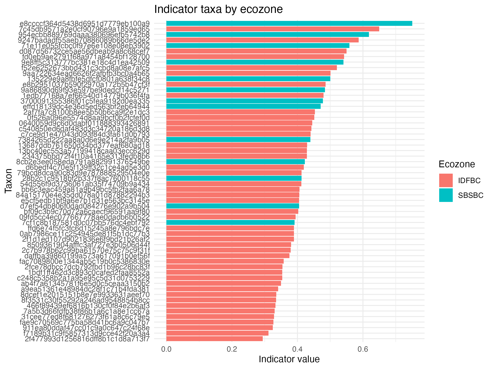

# Indicator Species Analysis (ISA)

## Aim:

- Identify microbial taxa that are significantly associated with LTSP treatment groups (REF, OM1, OM2) within each ecozone.
- Indicator Species Analysis (ISA) was used to detect taxa whose relative abundance patterns are strongly associated with specific treatments.

## Code:

soil_export/isa_analysis.R

## Results:

Indicator species analysis was performed separately for each ecozone using genus-level relative abundance data.  
The ISA algorithm (`multipatt` from the **indicspecies** package) identifies taxa whose occurrence and abundance are significantly associated with particular treatment groups.

A total of **58 significant indicator taxa** (p ≤ 0.05) were detected across ecozones.

The indicator value (statistic) reflects the strength of association between a taxon and a specific treatment group.

### Indicator taxa summary

The plot shows the taxa with the highest indicator values within each ecozone.  
Higher indicator values indicate stronger association between a taxon and a specific LTSP treatment group.
