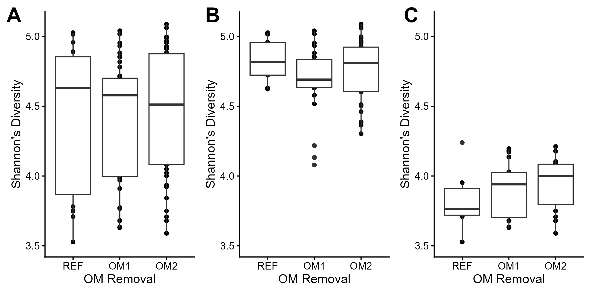
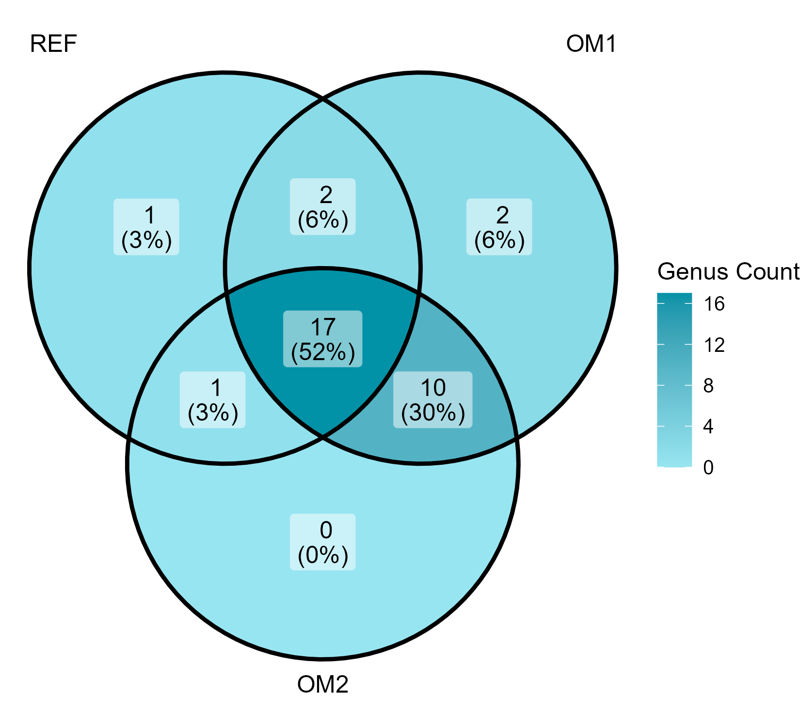
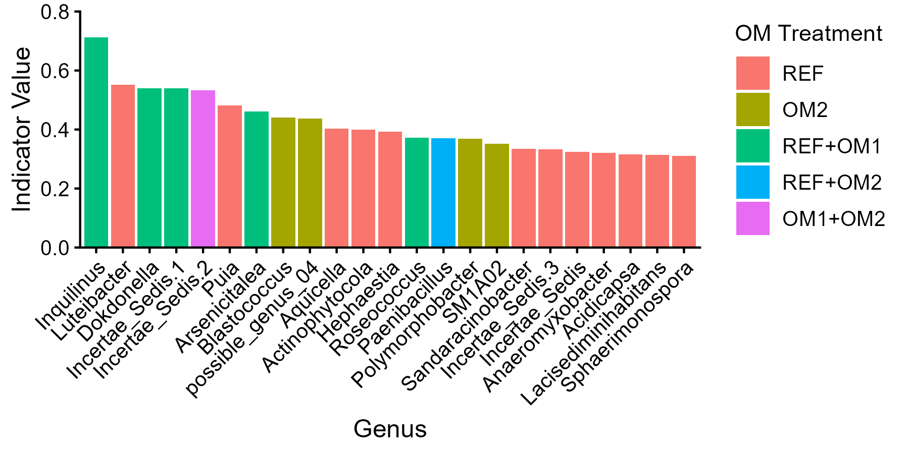
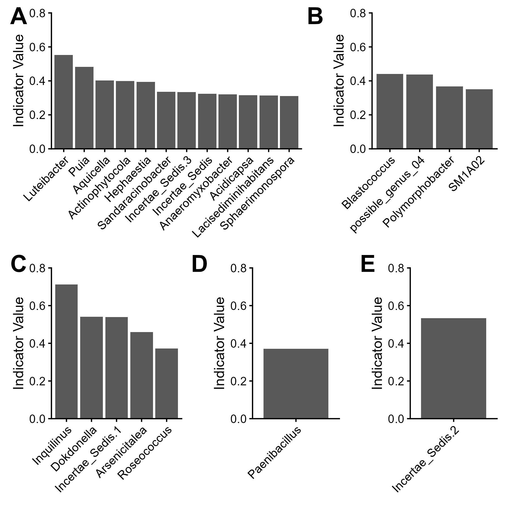
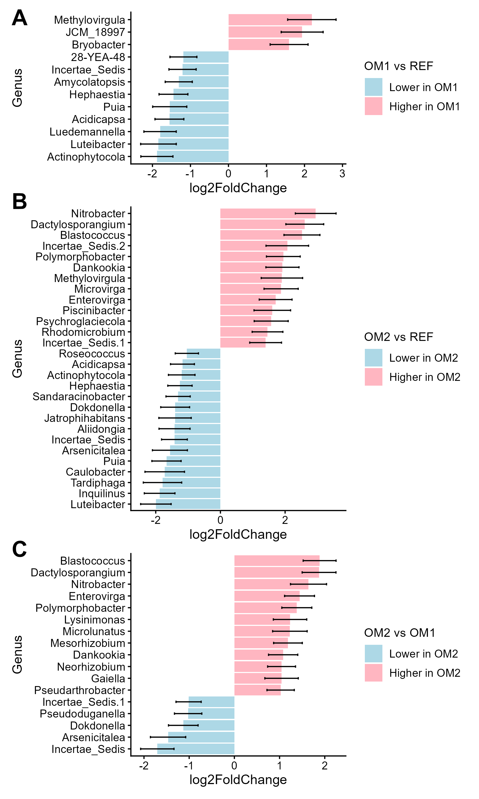
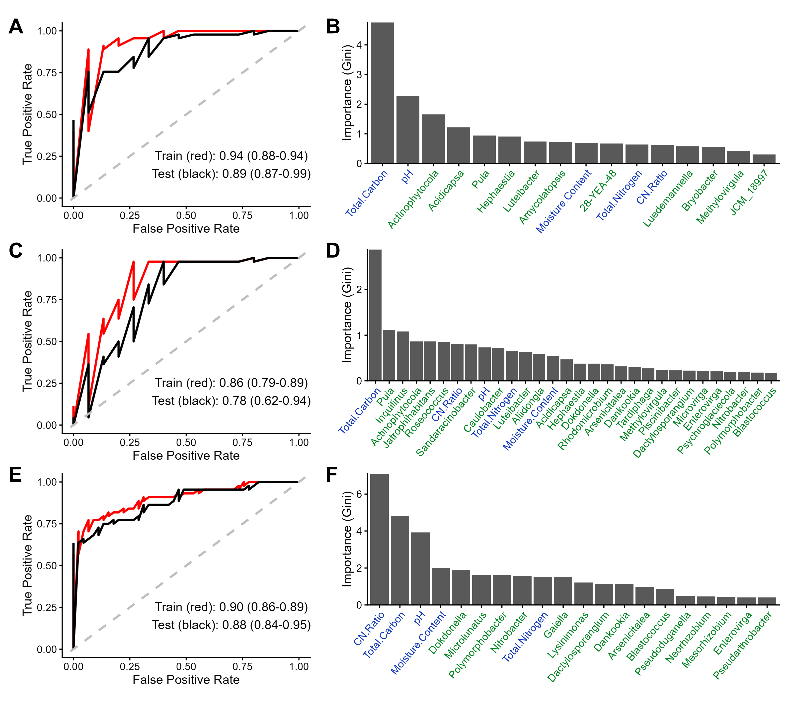

# April 2: Presentation and Manuscript Figures

## Agenda 
* Discuss presentation

## Manuscript Figures
**Figure 1**

**Figure 2 Option 1** \
Indicator Species

**Figure 2 Option 2**\
Indicator Species

**Figure 3** \
Core Microbiome

**Figure 4** \
DESeq

**Figure 5** \
Random Forest
